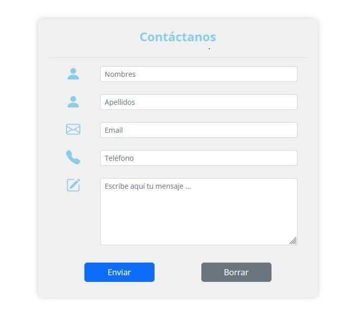
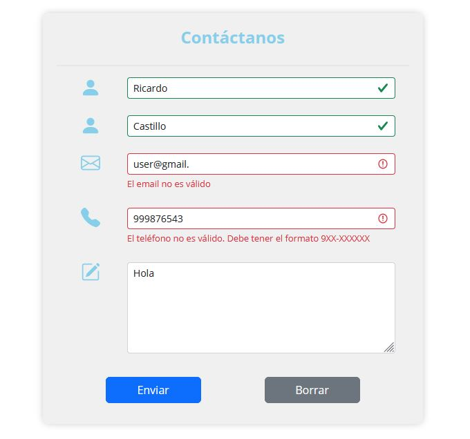
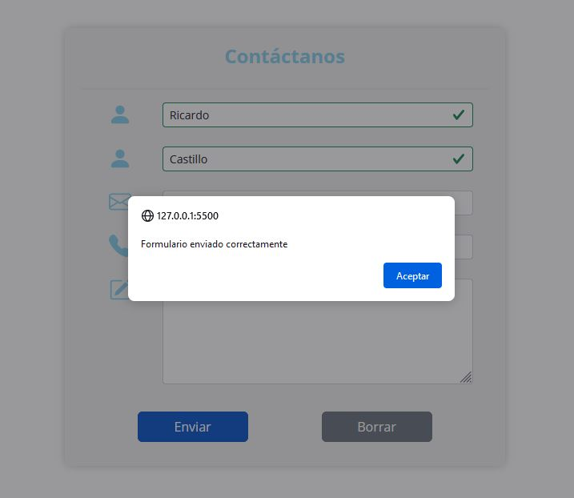

# Formulario de contacto

Formulario de contacto implementado utilizando Bootstrap y JavaScript. Incluye validaciones de campos a partir de expresiones regulares.

**Vista de la interfaz del formulario:**

  

**Vista de la interfaz del formulario con mensajes de validación:**

  

**Vista de la interfaz del formulario después de enviar los datos:**

  

