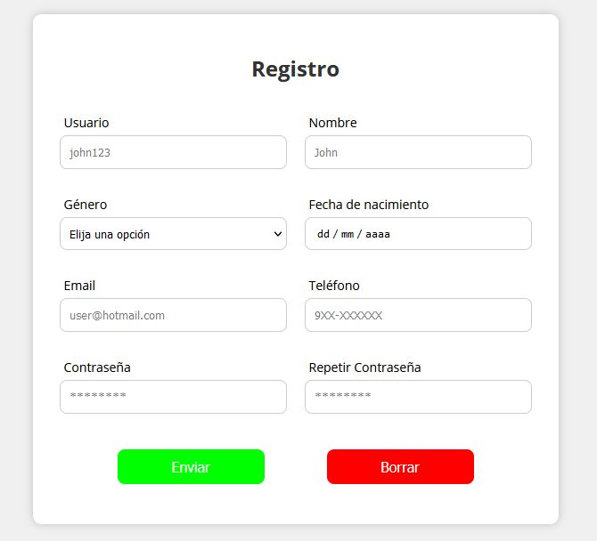
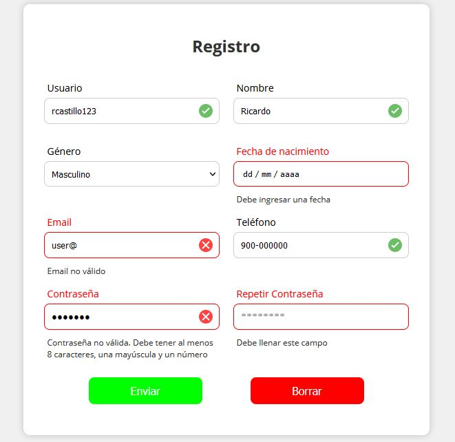
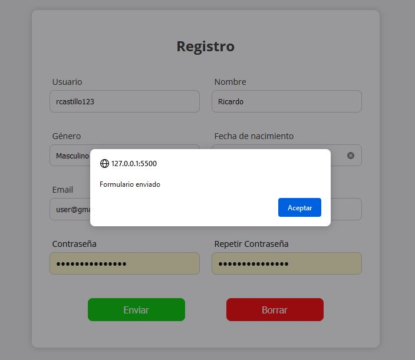

# Formulario de Registro

Formulario de registro de usuario implementado utilizando HTML, CSS, JavaScript y jQuery. Incluye validaciones de campos a partir de expresiones regulares.

**Vista de la interfaz del formulario:**

  

**Vista de la interfaz del formulario con mensajes de validación:**

  

**Vista de la interfaz del formulario después de enviar:**

  

